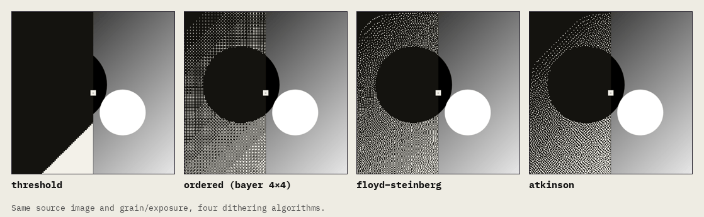
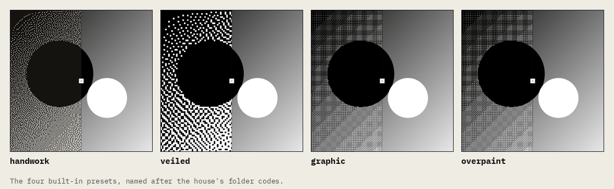
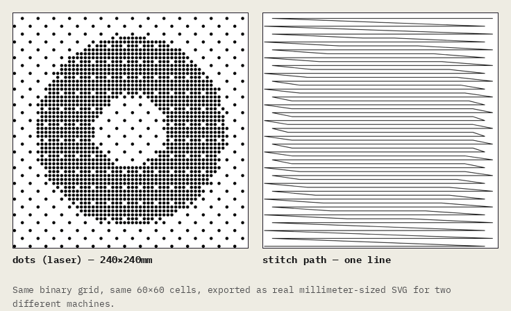

# pixel picnic


a browser-based dithering tool, styled and inspired after maison margiela's raw,
unbranded, construction-exposed visual language. dithering as a kind
of digital overpaint — degrading a photo down to the pixel seams
instead of smoothing them away.

the name's doing double duty: "pic" for picture, "picnic" for the
casual, poke-around-and-see playground this is meant to be, against
a look that's otherwise pretty severe.

**[live demo →](https://pixel-picnic.vercel.app)**


upload a photo, pick from four dithering algorithms (threshold,
bayer 4×4, floyd–steinberg, atkinson), and tune grain/exposure/palette
in real time with a before/after slider.

## running it

```
npm install
npm run dev
```

then open <http://localhost:3000>

## the four algorithms



all four reduce a grayscale image to pure black and white — no gray
values, ever — but they decide which pixel goes which way very
differently:

- **threshold** — no dithering at all, really. every pixel above 128
  goes white, everything else goes black. it's the control group:
  hard-edged and posterized, useful for seeing what the other three
  are doing *instead of*.
- **ordered (bayer 4×4)** — each pixel is compared against a fixed
  4×4 matrix of threshold values tiled across the image. the same
  matrix cell always gets the same threshold, so the pattern is
  perfectly regular — a crosshatch grid rather than noise. cheap,
  and the only one of the four with a repeating structure you can
  see.
- **floyd–steinberg** — classic error diffusion. every pixel's
  rounding error (the gap between its real gray value and the black
  or white it got pushed to) is distributed forward into its
  right, bottom-left, bottom, and bottom-right neighbors (7/16,
  3/16, 5/16, 1/16). errors accumulate and cancel out across the
  image, which is what gives error diffusion its organic, grainy
  look instead of a repeating pattern.
- **atkinson** — also error diffusion, but only 3/4 of each error
  gets passed on (six neighbors, 1/8 each) instead of the full
  amount. losing a quarter of the error each step keeps contrast
  higher and darker regions from muddying into gray-looking noise —
  it's the look most associated with the original macintosh.

`lib/dither.ts` implements all four as pure functions over a
`Float32Array` of grayscale values — framework-agnostic, no canvas
or DOM dependency, so the same code drives the tool, the fabrication
export, and the live camera view.

## presets



named after the folder-code system margiela used instead of
branded labels — 0 through 23, each a different line. these four
pair an algorithm with a grain and exposure setting that leans into
a particular mood: **handwork** (atkinson, coarse and uneven, like
something worked by hand), **veiled** (bayer, light and fine, barely
there), **graphic** (bayer, tight and high-contrast), **overpaint**
(floyd–steinberg, heavy and dense). a preset is a starting point —
every control underneath it stays live and adjustable.

## fabrication export



the same binary grid the dither tool produces, re-exported as an SVG
sized in real millimeters for a physical machine to cut, engrave, or
stitch:

- **dots (laser)** — one dot per "on" cell, sized to fill a set
  percentage of the cell, for laser-engraving a halftone.
- **stitch path** — the same grid walked as a single serpentine
  line, back and forth row by row, as a digitizing reference for an
  embroidery fill.

cell size is set in millimeters, not pixels, so the SVG a laser or
embroidery machine imports is already at the size it'll actually cut
or stitch — no unit conversion on the way in. `lib/vector-export.ts`
holds the grid-to-SVG logic; `components/FabricationExport.tsx` and
`app/fabrication/` are the UI. more techniques land here as they're
built.

## live, region-aware dithering

an on-device segmentation model (`@mediapipe/tasks-vision`, wrapped in
`lib/segmentation.ts`) finds the subject in your camera feed in real
time. the subject and the background each get their own algorithm and
exposure instead of one setting applied to the whole frame.

`ditherRegionAware()` in `lib/dither.ts` runs each region as a full,
independent dither pass and composites the two by mask afterward,
rather than mixing algorithms mid-diffusion — letting error-diffusion
noise cross a region boundary produces arbitrary artifacts right at
the seam, where two clean passes composited afterward don't.

everything runs client-side via wasm/GPU. the segmentation model file
loads once from google's CDN, then every frame after that stays
local — no frame is ever sent anywhere.

**[try it live →](https://pixel-picnic.vercel.app/live)**

## structure

- `lib/dither.ts` — the actual dithering math (threshold, bayer 4×4,
  floyd–steinberg, atkinson), framework-agnostic, works on raw
  `ImageData`. this is the shared core everything else builds on.
  binary only (2-level) — no gray-level quantization; that lived here
  briefly for e-ink export, now removed along with that feature.
- `components/DitherTool.tsx` — the client-side canvas UI: upload,
  algorithm/grain/exposure/palette controls, before/after slider,
  presets, shareable-settings URL, download.
- `components/RepeatHero.tsx` — the homepage's repetition-as-hero
  section, styled white-on-white.
- `components/FabricationExport.tsx` + `app/fabrication/` — the
  fabrication export hub described above.
- `app/og/route.tsx` — settings-seeded OG image for shared links.
  shows the settings, not the photo, since nothing is ever uploaded
  to a server.
- `lib/segmentation.ts` — wraps mediapipe's on-device selfie
  segmentation model, described above under live dithering.
- `components/LiveRegionDither.tsx` + `app/live/` — the live,
  region-aware camera view described above.
- `app/` — next.js app router pages, layout, global tokens.

## removed / spun off

- **e-ink export** — built, then removed. lived at `app/eink/` and
  `components/EinkExport.tsx`, targeting the waveshare 10.3"/7.5"
  panels with real bit-depth quantization. cut for scope, not because
  it didn't work.
- **punch card export** — built, then pulled out into its own
  separate project, since a punch card pattern generator for the
  KH-930 is its own practice, not just an export mode of an image
  tool. see that project for anything punch-card related going
  forward.

## roadmap (not yet built)

- **more fabrication techniques** — the fabrication hub is designed
  to grow; whatever's next goes here.
- **link into [tinytinker.tools](https://tinytinker.tools/)** — this fits that collection of
  browser-based maker tools; could move in as a route there instead
  of staying standalone.
